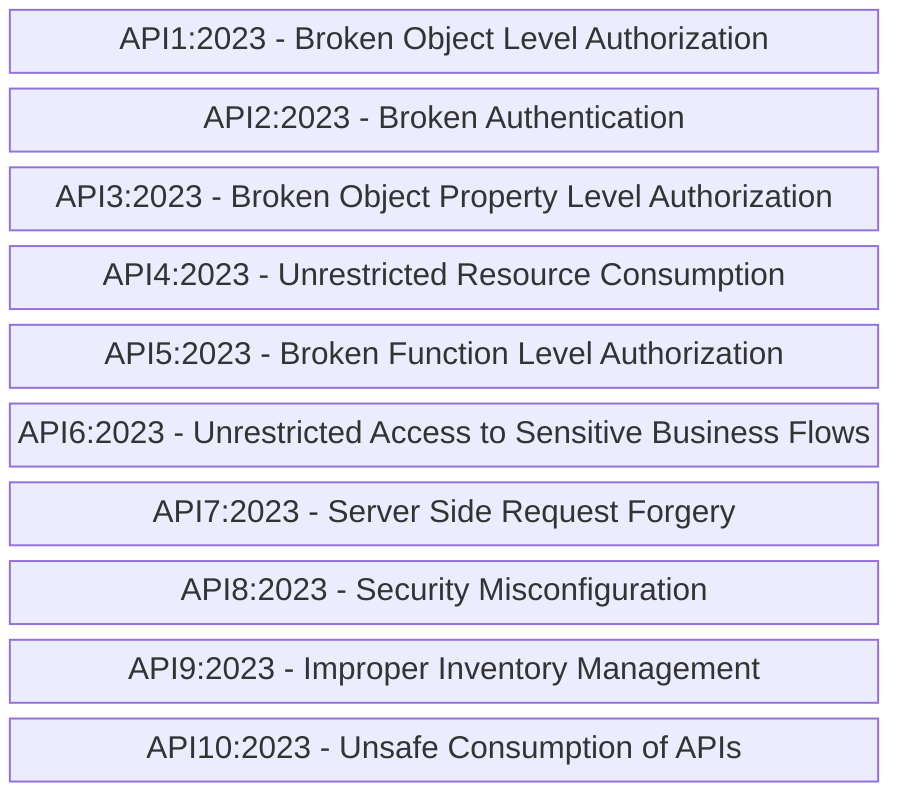

# OWASPAPISecurityTop10-Mermaid
Diagramas em Mermaid envolvendo itens que integram a lista de vulnerabilidades da OWASP API Security Top 10.

## OWASP API Security Top 10 2023

Riscos que fazem parte da **OWASP Top 10 API Security Risks - 2023**:

OBSERVAÇÃO: Para acessar a listagem oficial clique neste [**link**](https://owasp.org/API-Security/editions/2023/en/0x11-t10/).
